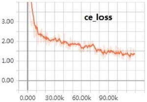

# State-of-the-art Single Shot MultiBox Detector in TensorFlow

This repository contains codes of the reimplementation of [SSD: Single Shot MultiBox Detector](https://arxiv.org/abs/1512.02325) in TensorFlow. If your goal is to reproduce the results in the original paper, please use the official [codes](https://github.com/weiliu89/caffe/tree/ssd).

There are already some TensorFlow based SSD reimplementation codes on GitHub, the main special features of this repo inlcudes:

- state of the art performance(~77%mAP) when training from VGG-16 pre-trained model (SSD300-VGG16).
- the model is trained using TensorFlow high level API [tf.estimator](https://www.tensorflow.org/api_docs/python/tf/estimator/Estimator). Although TensorFlow provides many APIs, the Estimator API is highly recommended to yield scalable, high-performance models. 
- all codes were writen by TensorFlow ops (no numpy operation) to ensure the performance and portability.
- using ssd augmentation pipeline discribed in the original paper.
- PyTorch-like model definition using high-level [tf.layers](https://www.tensorflow.org/api_docs/python/tf/layers) API for better readability ^-^.
- high degree of modularity to ease futher development.

## ##
## Usage
- Download [Pascal VOC Dataset](https://pjreddie.com/projects/pascal-voc-dataset-mirror/) and reorganize the directory as follows:
	```
	VOCROOT/
		   |->VOC2007/
		   |    |->Annotations/
		   |    |->ImageSets/
		   |    |->...
		   |->VOC2012/
		   |    |->Annotations/
		   |    |->ImageSets/ 
		   |    |->...
		   |->VOC2007TEST/
		   |    |->Annotations/
		   |    |->...
	```
	VOCROOT is your path of the Pascal VOC Dataset.
- Run the following script to generate TFRecords.
	```sh
	python dataset/convert_tfrecords.py --dataset_directory=VOCROOT --output_directory=./dataset/tfrecords
	```
- Download the pre-trained VGG-16 model from [here](https://drive.google.com/drive/folders/184srhbt8_uvLKeWW_Yo8Mc5wTyc0lJT7) and put them into one sub-directory named 'model'.
- Run the following script to start training:

	```sh
	python train_ssd.py 
	```
- Run the following script for evaluation and get mAP:

	```sh
	python eval_ssd.py 
	python voc_eval.py 
	```
	Note: you need first modify some directory in voc_eval.py.
- Run the following script for visualization:
	```sh
	python simple_ssd_demo.py
	```

All the codes was tested under TensorFlow 1.6, Python 3.5, Ubuntu 16.04 with CUDA 8.0. 

This repo is just created recently, any contribution will be welcomed.

## Results (VOC07 Metric)

This implementation(SSD300-VGG16) yield **mAP 76.94%** on PASCAL VOC 2007 test dataset(the original performance described in the paper is 77.2%mAP), the details are as follows:

| sofa   | bird  | pottedplant | bus | diningtable | cow | bottle | horse | aeroplane | motorbike
|:-------|:-----:|:-------:|:-------:|:-------:|:-------:|:-------:|:-------:|:-------:|:-------:|
|  80.6  |  75.3 |  51.8   |   85.1  |   77.1    |  81.7 |  49.3  | 85.5  |   80.1    |   83.9   |
| **sheep**  | **train** | **boat**    | **bicycle** | **chair**    | **cat**   | **tvmonitor** | **person** | **car**  | **dog** |
|  79.1  |  86.4 |  70.3   |   82.5  |   61.9    | 87.8 |  73.7  | 78.5  |   82.7   |   85.5   |

You can download the trained model(VOC07+12 Train) from [GoogleDrive](https://drive.google.com/open?id=1yeYcfcOURcZ4DaElEn9C2xY1NymGzG5W) for further research.

Here is the training logs and some detection results:





## ##
Apache License, Version 2.0